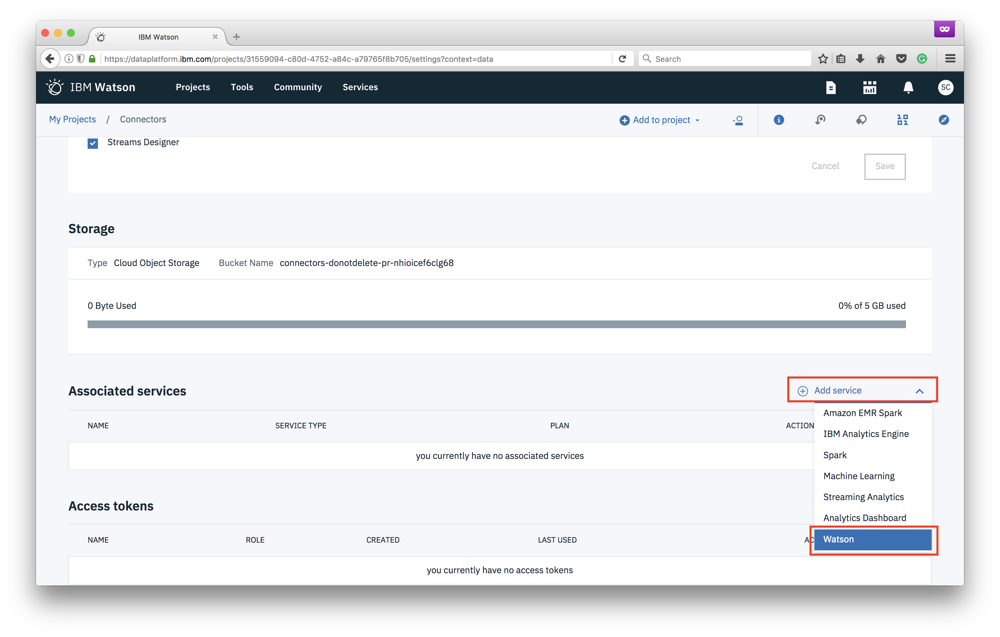
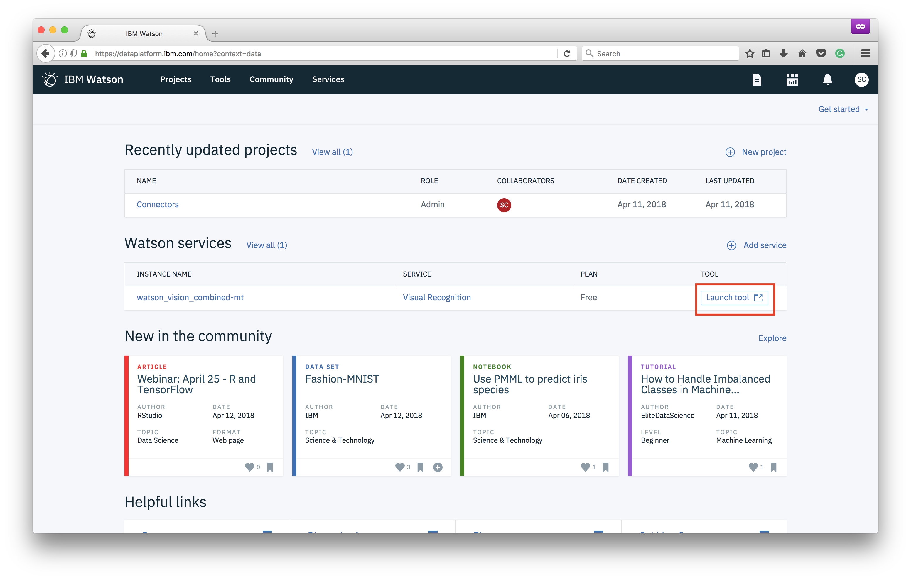
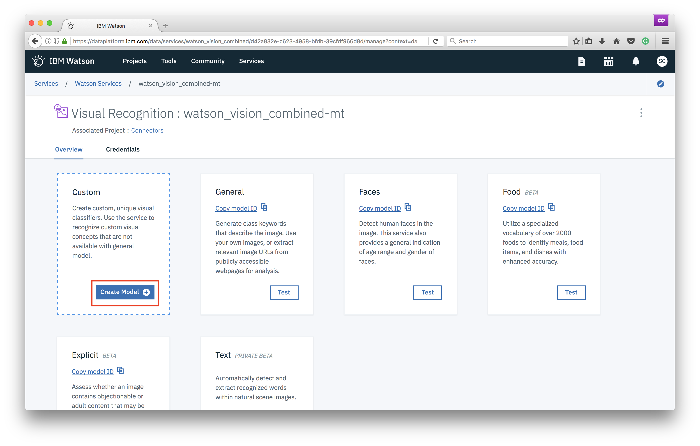
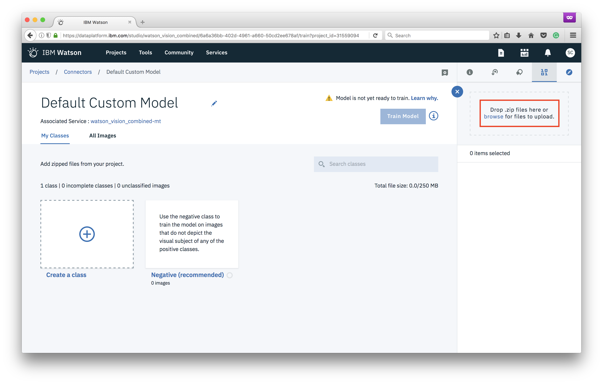
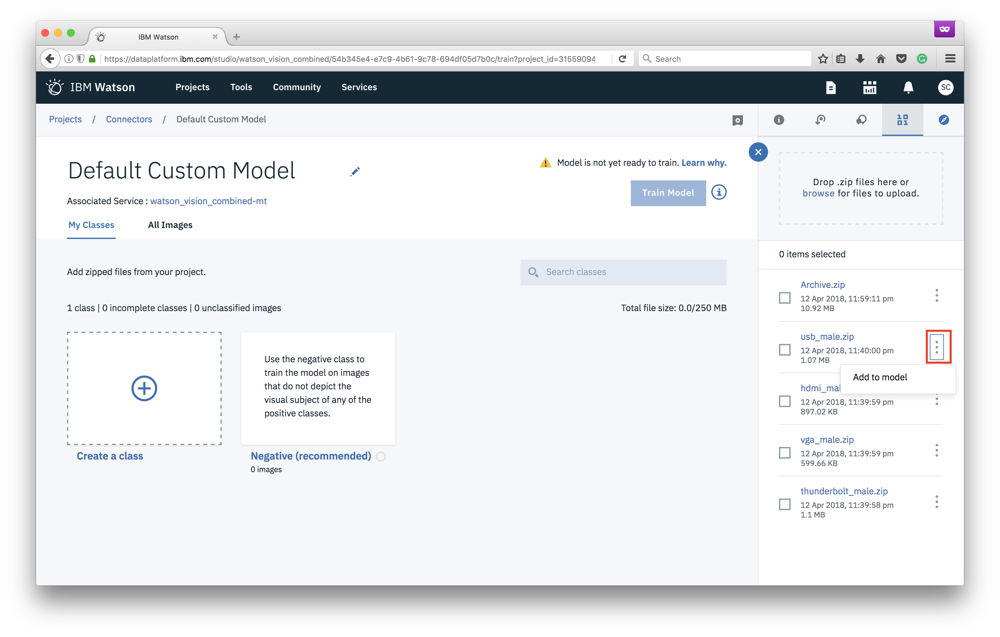
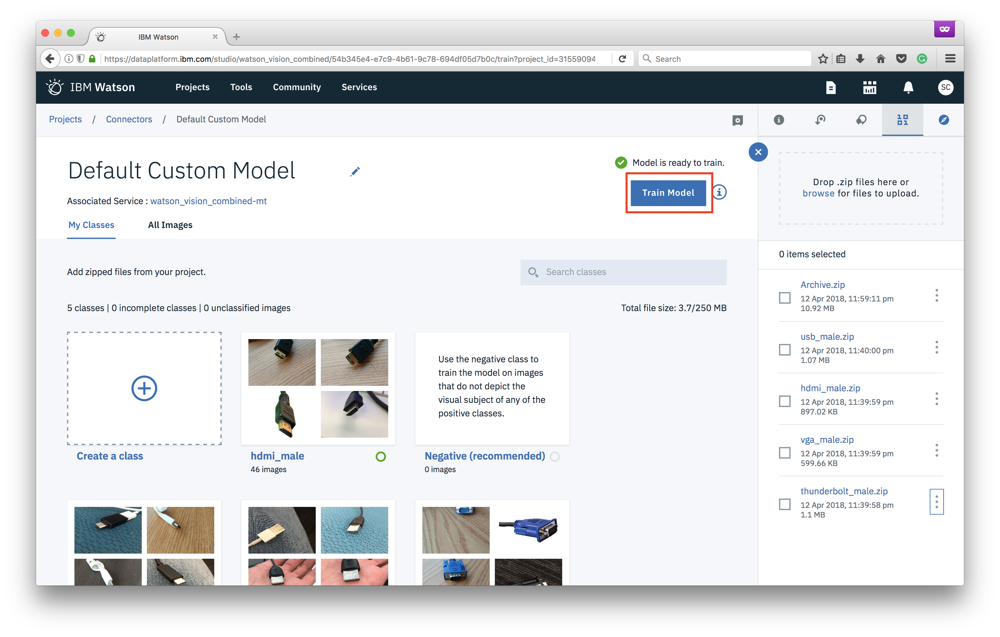

Navigate to [https://dataplatform.ibm.com](https://dataplatform.ibm.com).

1. Once in Watson Studio, click **New project**
1. Select the option for **Complete** and hit *OK*
1. Name your project *Connectors* and ensure that a storage object is selected for the project (if there is none, click **create** and follow the prompts)
1. From the project dashboard, select the **Settings** tab
1. Scroll down until you see the option to **Add service** and select **Watson**

1. Click **Add** in the **Visual Recognition** box, select the **Lite** option and hit **Create**
1. Return to the Watson Studio homepage, [https://dataplatform.ibm.com](https://dataplatform.ibm.com), you will see your new Visual Recognition service listed, hit the **Launch Tool** button

1. Next you will select the **Create Model** button within the box labeled **Custom**, this is where we begin to create our custom model

1. On the right side, click **browse** to select a .zip file

1. Navigate to the ‘Data/Training Images’ folder of the project you cloned from Github. Select the four .zip files and click open
1. It will take a moment for the zips to be uploaded. Once they are ready, click the three dots menu bar next to the files and click ‘Add to model’ for each .zip file

1. Allow a few moments for the files to load. The tooling will automatically create a class for the set of images based on the names of the .zip files. Once the images are done loading you can click ‘Train Model’ in the upper right corner. Please allow a few minutes for the model to train. You can open a new tab and proceed to the next section while your model trains

