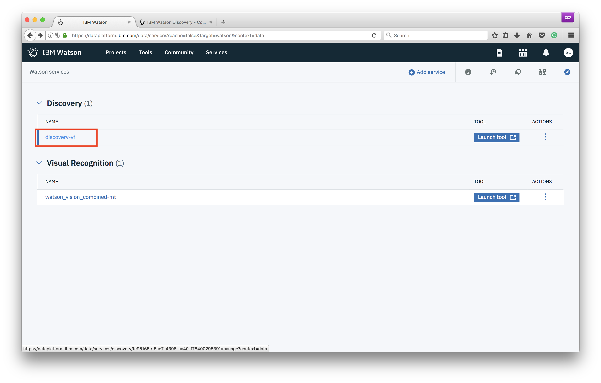
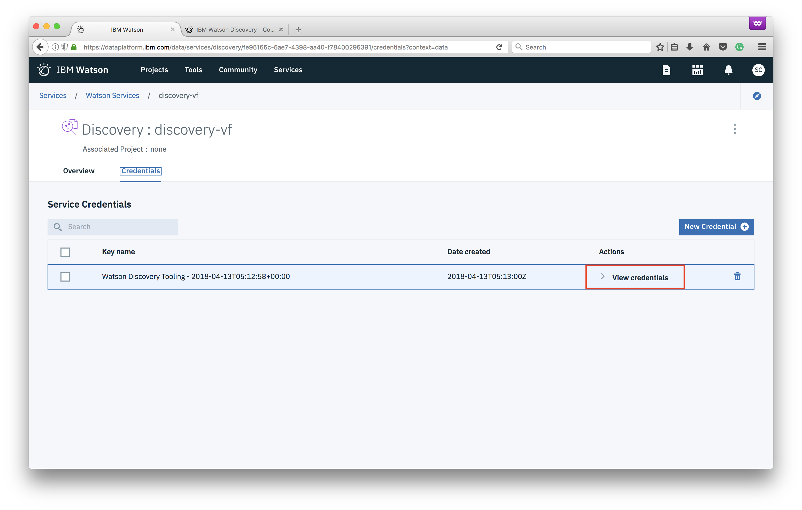

1. Open the project in Xcode by double clicking the `Core ML Vision Discovery.xcodeproj` file
2. Open `ImageClassificationViewController.swift`
3. Navigate back to the Discovery tooling. In your Connectors collection, click 'Use this collection in API.' Copy the Collection Id and Environment Id into the `discoveryCollectionID` and `discoveryEnvironmentID` string variables in the `ImageClassificationViewController.swift` file of your project

4. Back on the Watson Studio site, where you launched the Discovery tooling, click on the the name of your Discovery service

5. Click ‘Credentials’ and then click on 'View Credentials' to expand them. If no credentials are visible, you can click the 'Create Credentials' button to generate a new set. Copy the username and password here into the `discoveryUsername` and `discoveryPassword` variables in the `ImageClassificationViewController.swift` file

6. Go back to the Visual Recognition tooling, where you trained your model
7. Click on the ‘Connectors’ project that you created to go to the project overview. Go to Assets and click on the model that you just trained. In the ‘Overview’ section, copy the ‘Model ID’ into the `visualRecognitionClassifierID` variable in the file
8. At the top of the model overview page, where it says ‘Associated Service,’ click on your Watson Visual Recognition service
9. Click on the ‘Credentials’ section and then ‘View credentials. If no credentials exist, you can click the ‘New Credential’ button
10. Copy the `apiKey` into the `visRecApiKey` variable in the file
