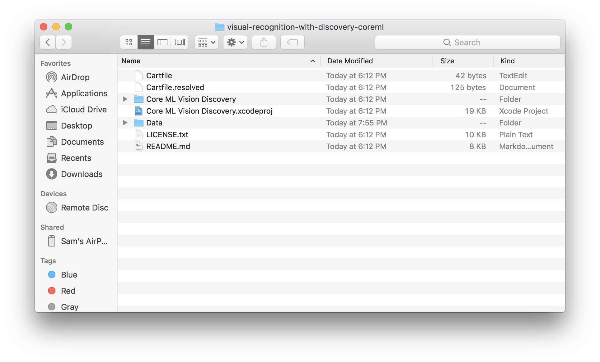
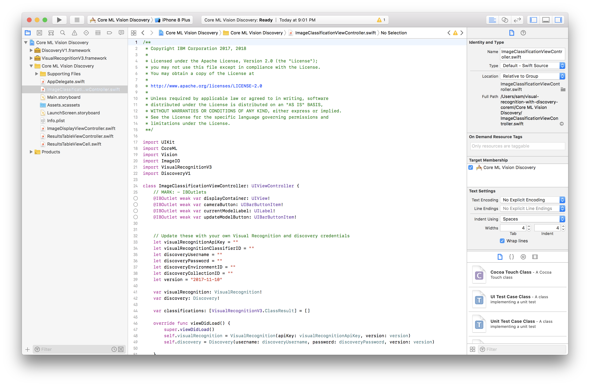
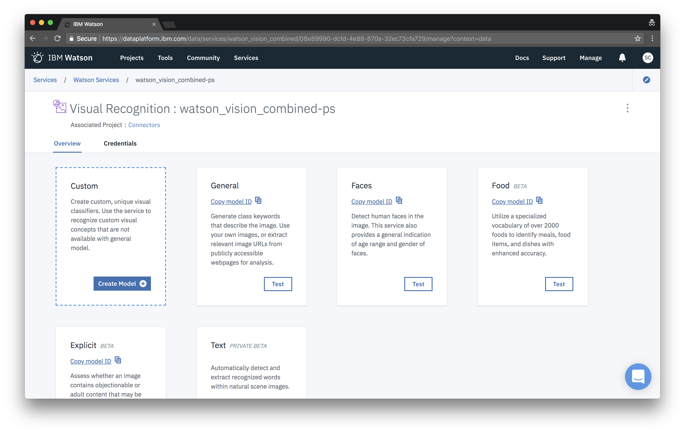
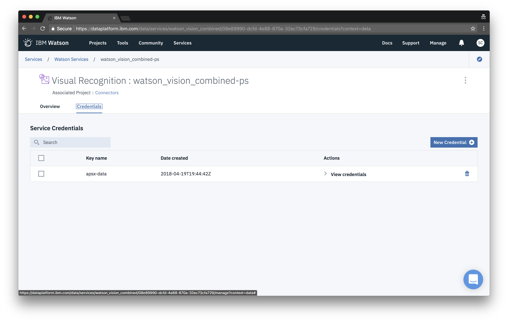
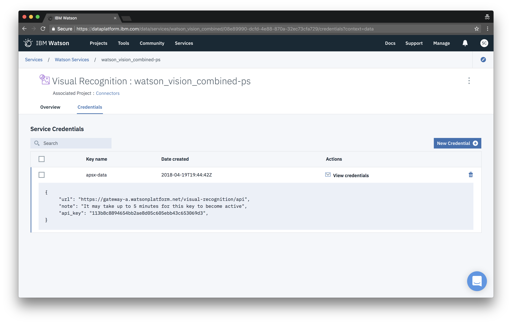
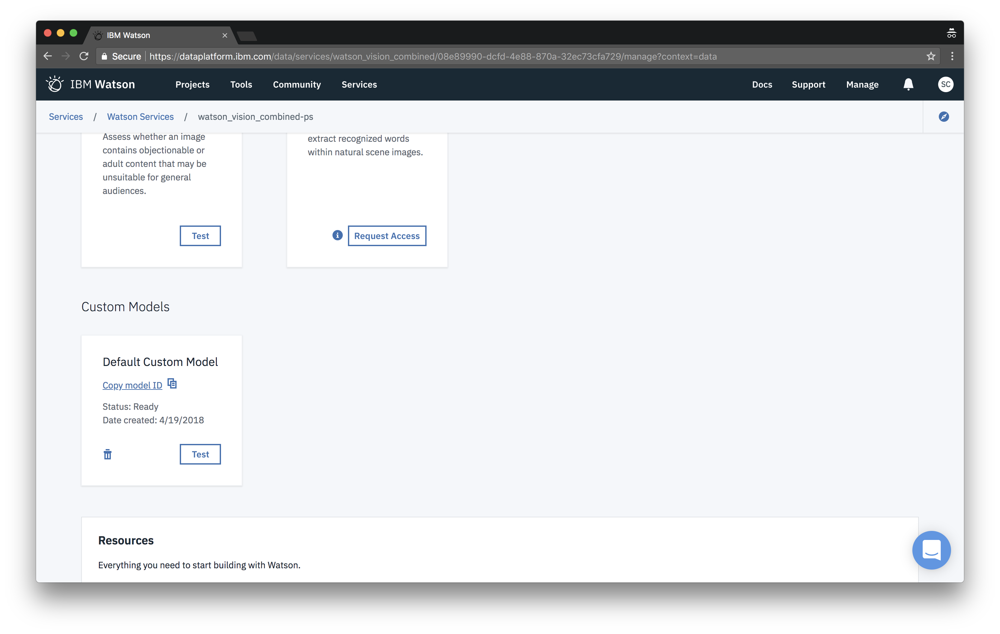

# THIS PAGE NEEDS UPDATED

1. Open the project directory in finder. You can do this with the following command
```bash
open .
```
Then double click the `Core ML Vision.xcodeproj` file to open the project in Xcode

1. Open the file called `CameraViewController.swift`

1. Go back to the Visual Recognition dashboard, where you trained your model

1. Click the **Credentials** tab

1. Click **View Credentials**. We'll need to copy the `api_key`

1. Paste the `api_key` into the `ImageClassificationViewController.swift` file, at the line that reads
```swift
let visualRecognitionApiKey = ""
```
1. Navigate back to the Visual Recognition dashboard once again, scroll down to the section labeled **Custom Models**

1. Click **Copy model ID**
1. Paste the **Model ID** into the `ImageClassificationViewController.swift` file, at the line that reads
```Swift
let visualRecognitionClassifierID = ""
```
