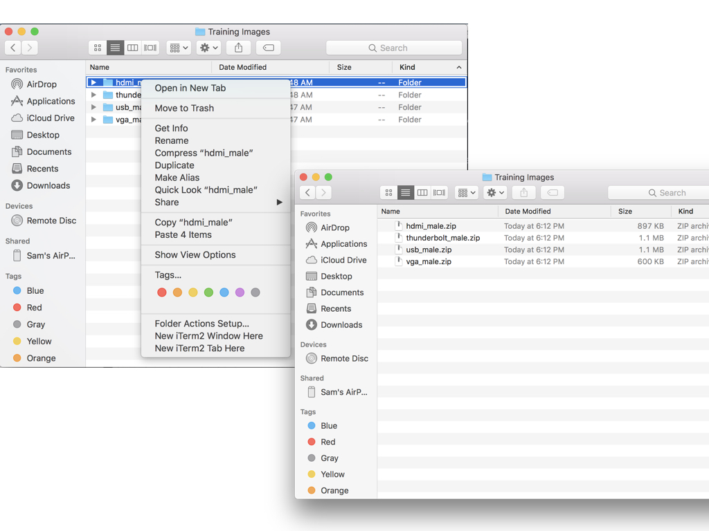

In order to create our model, we have to provide training images to the classifier. For time's sake we have prepared the data for you.

Each class we create should have *at least* **10** images. However, for optimal training time and accuracy it's best to have around 200 images sized at 224 x 224 pixels. Also, it's good practice to have images from an environment comparable to what you expect to classify. For example, since this is an iOS app, photos from your smartphone camera are probably ideal, verses professional photos or image search results. Also, try and change the background, lighting, and any other variables that you can think of!

# Preparing our data
There are multiple flavors of this workshop with different associated image content. Please follow the appropriate instructions. **You only need to do one of the steps below.**

## 3A -- Connectors
Download the [training image dataset](https://github.com/watson-developer-cloud/watson-vision-coreml-code-pattern/releases/download/1.0/Training.Images.zip), and unzip the contents to your desktop

## 3B -- Arduino boards
Download the [training image dataset](https://github.com/watson-developer-cloud/watson-vision-coreml-code-pattern/releases/download/3.1/arduino_training_images_small.zip), and unzip the contents to your desktop.

**Note:** you have actually been provided with data for **two different models**, one for part identification (`part_*`) and one for fault detection (`fault_*`)

## 3C -- Collect your own images
Take a few minutes to take photos of the various items to prepare our data. Make sure to take *at least* **10** images of each item or class. For best results, change the background, lighting, and any other variables that you can think of! (Once you're done taking photos, use airdrop to transfer the images to your computer)

Now we need to prepare our data by classifying each image.
1. Create an empty folder for each *type* of item

1. Sort through your images, putting each in the correct folder based on the type of item.
1. Once all of your images are in the correct folder, archive each folder to create individual *.zip* files ***Note: on OS X, "compress" is used to create a .zip***

