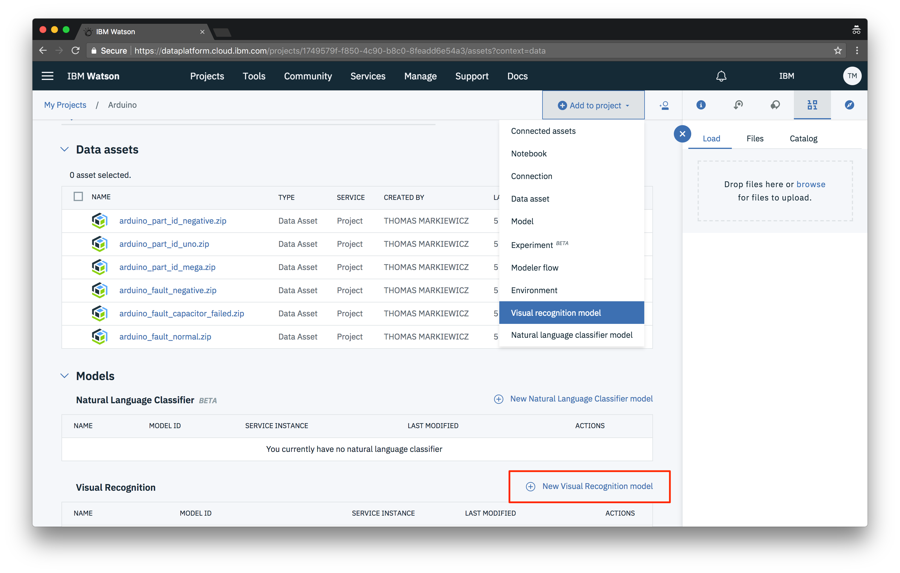
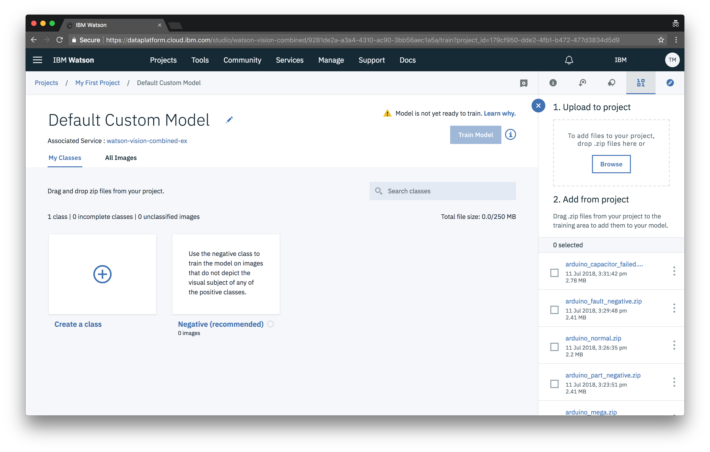
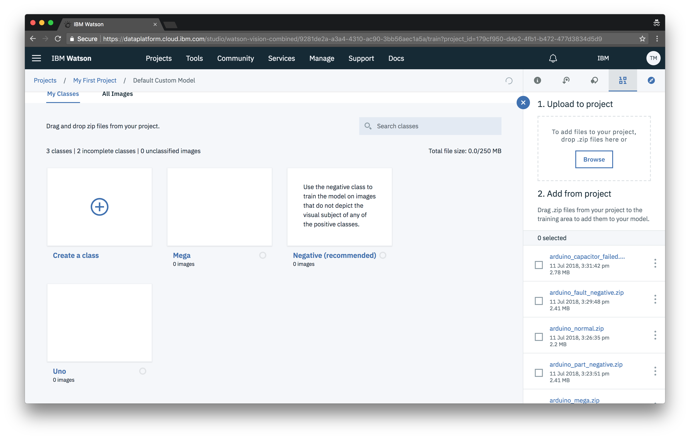
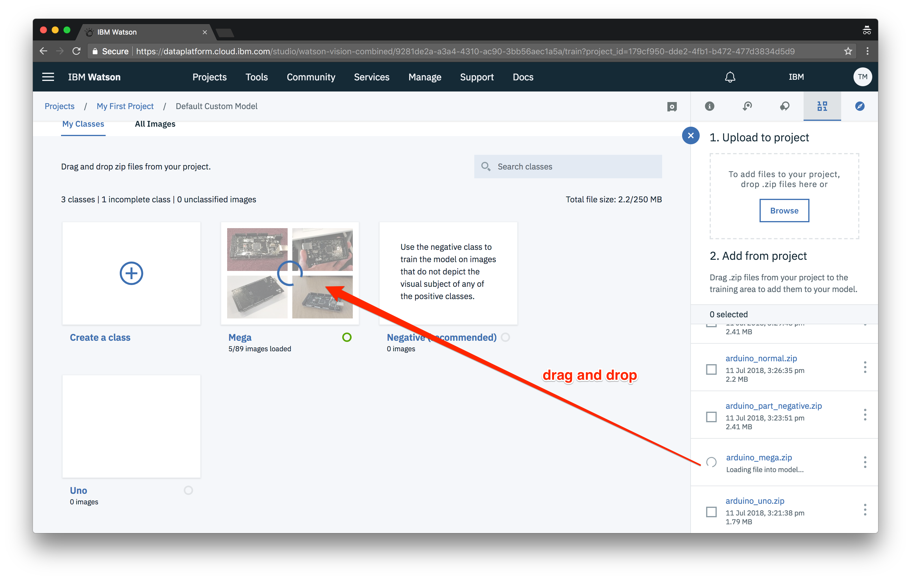
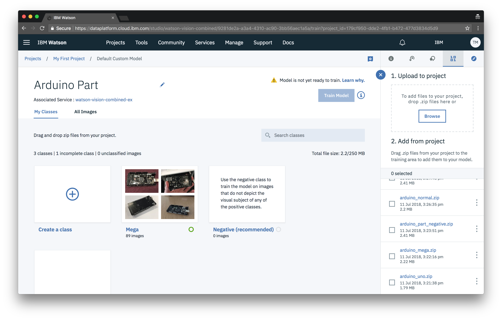
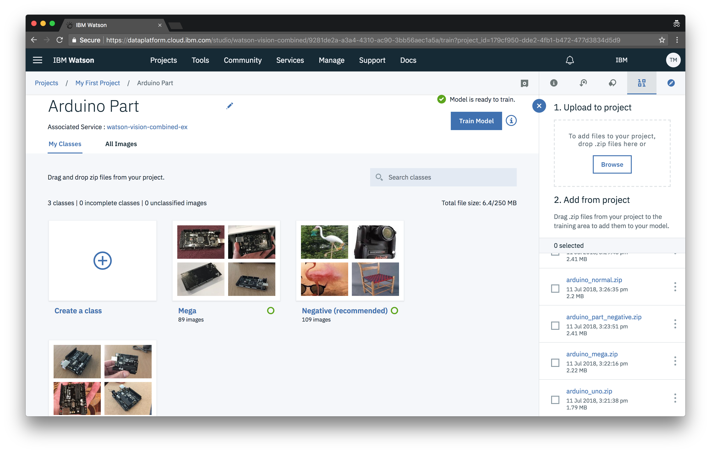
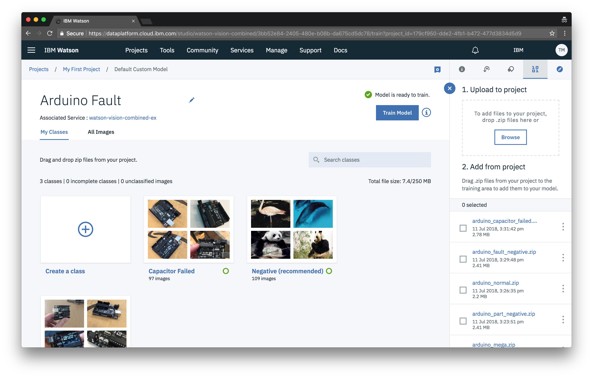

The next part of the process is creating your own custom visual recognition model. Please follow **only one** of the below steps, depending on which flavor of the workshop you are doing.

1. [7A -- Creating a model for the Connectors data](#7a)
2. [7B -- Creating a model for the Arduino data](#7b)
3. [7C -- Creating a model for your own data](#7c)

---

## 7A -- Creating a model for the Connectors data

You can create a model by either going to assets and pressing **New visual recognition model** under **Visual recognition models**.

Or by pressing the **Add to project** dropdown from anywhere in your project and choosing **Visual recognition model**.

When you create a new model you should automatically be directed to the models training area.  If you need to find your way back to this page you can do so by navigating to your project *(Projects > My First Project)* then under the **Assets** tab click on your model under the **Visual recognition models** section.

Create a new class for each *type* of connector.

Then drag and drop the zip files from the side panel onto the corresponding class.

After all your classes are complete, you are ready to train your model. Just press the **Train Model** button.

---

## 7B -- Creating a model for the Arduino data

You can create a model by either going to assets and pressing **New visual recognition model** under **Visual recognition models**.

Or by pressing the **Add to project** dropdown from anywhere in your project and choosing **Visual recognition model**.

When you create a new model you should automatically be directed to the models training area.  If you need to find your way back to this page you can do so by navigating to your project *(Projects > My First Project)* then under the **Assets** tab click on your model under the **Visual recognition models** section.

Create a new class for each *type* of Arduino part. Specifically, create a class for "Mega", then "Uno", and finally create a "Negative" class.

Then drag and drop the zip files from the side panel onto the corresponding class.

After all your classes are complete, you are ready to train your model. Just press the **Train Model** button.

Repeat the above steps for the second model of Arduino faults. Specifically, create a class for "Capacitor Failed", then "Normal", and finally create a "Negative" class.

---

## 7C -- Creating a model for your own data

Follow the above steps, substituting your own classes and model(s) from the data you collected.

---

## After kicking off the training jobs (all workshop versions)

Training time can vary depending on the amount of training data. A good rule of thumb is a few seconds per image. Since we have a smaller number of images, we can expect the model to take about 5–10 minutes to train.

In the meantime we can start preparing the iOS app.
